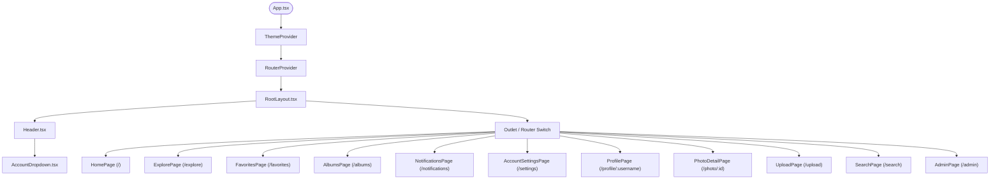

# 📸 Codebase Summary: Photo Sharing App UI Demo ("Chia Sẻ Ảnh")

Welcome to the **Photo Sharing App UI Demo** codebase! This is a state-of-the-art, high-fidelity React web application designed to demonstrate a responsive, premium user interface for a bilingual photo-sharing social network. Originating from a high-quality Figma layout, it has been built using cutting-edge frontend tooling, modern styling tokens, and an interactive state structure.

---

## 🏗️ 1. Project Architecture

The project follows a standard React-Vite modular structure where stylesheets, global assets, layout containers, contexts, component libraries, and page screens are cleanly decoupled. Below is an overview of the key directories:

```
Photosharingappui/
├── guidelines/                 # Codebase guidelines template
│   └── Guidelines.md
├── src/                        # Core Application Source code
│   ├── main.tsx                # DOM Entry point
│   ├── app/                    # React codebase sub-root
│   │   ├── App.tsx             # Root component, wraps Theme & Router
│   │   ├── routes.tsx          # Client-side router declarations
│   │   ├── components/         # Shared component registry
│   │   │   ├── Header.tsx      # Main application navbar
│   │   │   ├── AccountDropdown.tsx # Account configuration & actions panel
│   │   │   ├── PhotoCard.tsx   # Single photo preview thumbnail
│   │   │   ├── figma/          # Figma compatibility components
│   │   │   │   └── ImageWithFallback.tsx # Auto-recovering image component
│   │   │   └── ui/             # Radix UI / Shadcn UI primitive blocks
│   │   ├── contexts/           # React contexts
│   │   │   └── ThemeContext.tsx # Theme provider (Light / Dark mode)
│   │   ├── layouts/            # Page layouts
│   │   │   └── RootLayout.tsx  # General layout wrapping all route modules
│   │   └── pages/              # App screens/pages (11 key views)
│   │       ├── HomePage.tsx            # Main feeds (Latest & Popular)
│   │       ├── ExplorePage.tsx         # Tag curation and search entry
│   │       ├── FavoritesPage.tsx       # Starred photos gallery
│   │       ├── AlbumsPage.tsx          # Custom photo grouping albums
│   │       ├── NotificationsPage.tsx   # Feed likes & follower activity list
│   │       ├── AccountSettingsPage.tsx # User settings console (tabbed)
│   │       ├── ProfilePage.tsx         # User biography and statistics showcase
│   │       ├── PhotoDetailPage.tsx     # Photo display + EXIF + Comments list
│   │       ├── UploadPage.tsx          # Drag-and-drop simulated publisher
│   │       ├── SearchPage.tsx          # Advanced tag & string query matching
│   │       └── AdminPage.tsx           # Administrative dashboard metrics & controls
│   └── styles/                 # Styling system variables
│       ├── index.css           # Styling import controller
│       ├── fonts.css           # Font asset configurations
│       ├── tailwind.css        # Tailwind core & animation libraries
│       └── theme.css           # OKLCH / CSS custom properties and typography rules
├── package.json                # Project dependencies, scripts, metadata
├── vite.config.ts              # Vite configuration & Figma custom asset resolver
└── pnpm-workspace.yaml         # PNPM workspace setup (if multi-package)
```

---

## 🛠️ 2. Configuration & Tooling

The application leverages high-performance frontend compilation and tooling:

*   **Vite 6 (`vite.config.ts`)**: Configured with `@vitejs/plugin-react` for React processing and `@tailwindcss/vite` for Tailwind's modern engine. It includes a custom asset resolver plugin (`figmaAssetResolver`) to gracefully load Figma-specific imports mapping `figma:asset/` to local assets in `src/assets`.
*   **TypeScript**: Strictly typed definitions throughout layouts, contexts, and helper callbacks (`.ts` and `.tsx`).
*   **Tailwind CSS v4 & theme.css**: A highly customized visual engine. Instead of standard HEX variables, it relies on modern OKLCH color palettes defined within `@theme inline` mapping directly to global `:root` and `.dark` blocks.
*   **Asset Support**: `vite.config.ts` declares raw loading support for `.svg` and `.csv` assets.

---

## 📦 3. Dependency Stack

The app integrates a powerful dependency stack to build high-fidelity interactive designs:

### UI & Styling System
*   `tailwindcss` (v4.1.12): Modern utility CSS framework.
*   `@tailwindcss/vite` (v4.1.12): Integrates Tailwind directly into the compiler.
*   `clsx` & `tailwind-merge`: Enables dynamic class concatenations without utility overriding conflicts.
*   `tw-animate-css`: Pre-baked keyframe animations.
*   `motion` (v12.23.24) / Framer Motion: Powers premium transitions and micro-animations.

### Base Component Primitives (Shadcn/UI based on Radix UI)
*   Provides robust components under `src/app/components/ui/` covering forms (`react-hook-form`), calendars (`react-day-picker`), navigation headers, accordions, alerts, charts (`recharts`), drag-and-drop backends (`react-dnd`), and overlays (Radix UI Accordion, Dialog, Dropdown, Menu, Hover-Card, Popover, Slider, Switch, Sheet, Sidebar, Tabs, Tooltip, Drawer).

### Utility & Icon Libraries
*   `lucide-react` (v0.487.0): Aesthetic vector iconography system.
*   `canvas-confetti` (v1.9.4): Visual celebration scripts upon successfully uploading images.
*   `date-fns` (v3.6.0): Easy date formatting utility.

---

## 📡 4. Navigation Flow & Routes

The client-side router is powered by `react-router` (v7) in `src/app/routes.tsx`. All routes are nested inside `RootLayout` which mounts a sticky `Header` globally:



---

## 💻 5. Core Components & Contexts

### 🌗 ThemeContext (`src/app/contexts/ThemeContext.tsx`)
Coordinates app-wide mode states (`light` vs `dark`).
*   **State Persistence**: Watches and reads theme configuration from `localStorage`.
*   **DOM Injection**: Appends or ejects the `.dark` class directly onto `document.documentElement` to trigger CSS variables in `theme.css`.

### 🧭 Header (`src/app/components/Header.tsx`)
Responsive structural shell that handles primary layout navigation.
*   Includes brand logo with dynamic gradients.
*   Houses a functional search form triggering navigation to `/search?q={query}`.
*   Provides navigation buttons representing main nodes: Home, Explore, Favorites, Upload, and Notifications (which lists active notification badges).
*   Hosts the `AccountDropdown` widget.

### 👤 AccountDropdown (`src/app/components/AccountDropdown.tsx`)
An immersive interactive widget allowing context operations:
*   Displays user information (avatar, name, email address).
*   Contains links to user shortcuts (My Profile, Starred Favorites, Custom Albums, Notifications, Admin Panel, and General Settings).
*   Houses an interactive **Dark Mode Switch** connected to `ThemeContext`.
*   Provides a logout action button.

### 🖼️ PhotoCard (`src/app/components/PhotoCard.tsx`)
Renders single-item photo modules in standard lists/grids:
*   Features a responsive thumbnail container displaying the image via `ImageWithFallback`.
*   Displays the post title, description, tags, and author card details.
*   Exposes interactive controls: **Like trigger** (incrementing like count with reactive red styling), comment stats, and view count metric.

### 🛡️ ImageWithFallback (`src/app/components/figma/ImageWithFallback.tsx`)
Ensures visual robustness. Under ordinary conditions, it displays native `` elements. If the target `src` fails to load (e.g. broken link, network disruption), it catches the error using the `onError` hook and displays a clean fallback SVG placeholder.

---

## 📄 6. Screen-by-Screen Breakdown

### 🏠 HomePage (`HomePage.tsx`)
The user's central workspace feed.
*   **Dynamic Sorting**: Toggle between **Mới Nhất** (Latest) and **Phổ Biến** (Popular - sorted reactively by like counts).
*   **Grid layout**: Renders an adaptive photo grid that behaves responsively on mobile, tablet, and desktop screens.
*   **Mock State**: Interactivity supports liking images directly from the home feed with localized state updates.

### ⛰️ PhotoDetailPage (`PhotoDetailPage.tsx`)
Highly detailed page for viewing individual assets.
*   **Camera EXIF Display**: Tabulating technical variables of shots (Camera brand, lens configuration, ISO settings, apertures, shutter speed).
*   **Action Drawer**: Buttons supporting Like toggling, bookmarking/saving, asset downloading, reporting, and sharing.
*   **Interactive Share Overlay**: Triggers popup share menus for Facebook, Twitter, and native clipboard copying.
*   **Comment System**: Features list of comments and a submission form that updates page comments locally in state.

### 📂 AlbumsPage (`AlbumsPage.tsx`) & FavoritesPage (`FavoritesPage.tsx`)
*   **Albums**: Shows standard grid directories representing custom asset groupings folders.
*   **Favorites**: Curates the user's custom collection of liked and bookmarked pictures.

### 🔍 ExplorePage (`ExplorePage.tsx`) & SearchPage (`SearchPage.tsx`)
*   **Explore**: Feeds recommended trending posts, active hashtags, and high-quality photography styles.
*   **Search**: Resolves text queries and filters results according to matching titles or tag badges.

### 🔔 NotificationsPage (`NotificationsPage.tsx`)
*   Houses tabular feeds displaying activities: likes on photos, text comments under assets, and new followers joining the profile.

### ⚙️ AccountSettingsPage (`AccountSettingsPage.tsx`)
Tabbed configuration panel divided into:
1.  **Hồ Sơ (Profile)**: Edit public name, avatar, bio description, and website.
2.  **Tài Khoản (Account)**: Edit email address, initiate password changes, trigger 2FA configuration, or delete account in the danger zone.
3.  **Quyền Riêng Tư (Privacy)**: Toggle public visibility, allow downloads, and expose stats.
4.  **Thông Báo (Notifications)**: Manage push triggers for likes, comments, followers, and email newsletters.

### 📤 UploadPage (`UploadPage.tsx`)
*   Interactive drag-and-drop workspace where users can drag, select, name, and categorize images with tags before generating a visual notification (with confetti trigger).

### 👑 AdminPage (`AdminPage.tsx`)
A powerful administrative console divided into:
1.  **Tổng Quan (Overview)**: Grid displaying metrics (Total users, photos, comments, active traffic) along with real-time system activities and popular monthly tags.
2.  **Kiểm Duyệt (Moderation)**: List of pending images where admins can approve or reject uploads.
3.  **Người Dùng (Users)**: Tabulated system user registry showing access controls, enabling admins to block/lock spam users.
4.  **Báo Cáo (Reports)**: Ticket tracker where reports can be processed, reviewed, or deleted.

---

## 🚀 7. Local Development Guide

### Prerequisite
Ensure you have Node.js and a package manager installed (`pnpm` is highly recommended since it has lock and workspace mappings):
```bash
# Verify pnpm is installed
pnpm -v
```

### Installation
Run the following commands in the project root:
```bash
# Install dependencies
pnpm install
```

### Run Locally
Launch the fast HMR development server:
```bash
# Start dev server
pnpm dev
```
Open [http://localhost:5173](http://localhost:5173) in your web browser.

### Build Production Bundle
Prepare application assets for static hosting:
```bash
# Build standard production distribution
pnpm build
```

---

> [!TIP]
> **Extending the Project**: When adding new features or components, always use modern styling properties defined in `src/styles/theme.css` to respect the system design tokens. The application utilizes Tailwind CSS v4, so you can leverage the `@theme inline` classes seamlessly!
